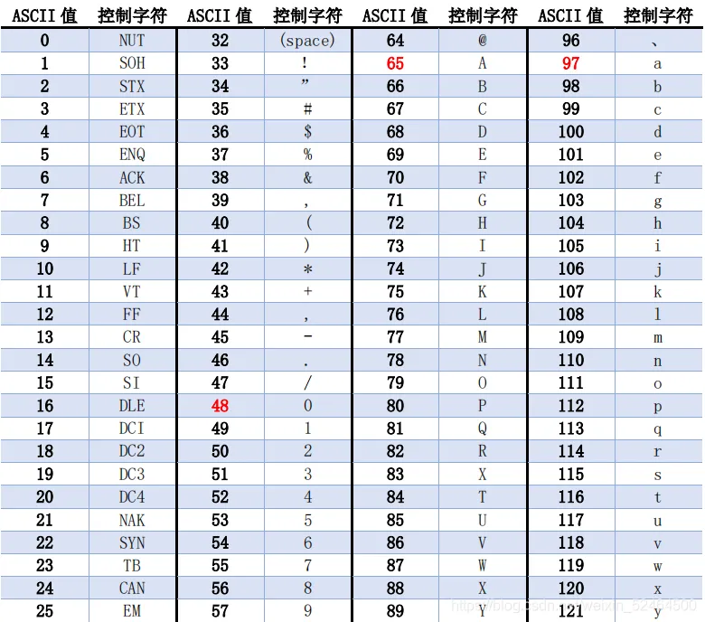

# 常用STL
## vector，可变长数组
* void push_back(const T& x):向量尾部增加一个元素X
* iterator insert(iterator it,const T& x):向量中迭代器指向元素前增加一个元素x
* iterator erase(iterator it):删除向量中迭代器指向元素
* iterator erase(iterator first,iterator last):删除向量中[first,last)中元素
* void pop_back():删除向量中最后一个元素
* void clear():清空向量中所有元素
* bool empty() const:判断向量是否为空，若为空，则向量中无元素
* int size() const:返回向量中元素的个数
* void swap(vector&):交换两个同类型向量的数据

## queue个人bfs用的多
* void push() 插入队尾
* void pop() 从队头丢弃
* T front() 得到队头的数(大致就这样了)

## priority_queue(堆, 用处多得是)
* void push()
* T top()顶部
* void pop()
* size_t size(); bool empty(); 

## pair<T1, T2> / tuple<T...>
* get< i >(T);
* ps.second; ps.first; 

## string+c的字符串
* getline(cin, s1);
* string s(cp,num)拷贝数组
* substr(pos,num)返回一个子串
* iterator erase(const_iterator position)如果string对象s调用，它删除s迭代器position位置的字符，并返回下一个字符的迭代器。
* iterator erase(const_iterator first, const_iterator last)如果string对象s调用，它删除s迭代器[first,last)区间的字符，并返回last字符的迭代器。
* 插入insert
```
string s1("value");

s1.insert(0,2,’s’); //执行后，s1为” ssvalue”
s1.insert(5,2,’s’); //执行后，s1为” valuess”
```
* c语言 strtok(str,c)：对字符串按照子字符串c（可以是单个字符）进行分割，返回分割后的子字符串。
* 字符串拼接函数——strcat()
* 字符串转整型——strtol()
```   
long int strtol(const char *str, char **endptr, int base)：
```
* gets()和puts()
## set(mutiset) 一般使用就当平衡搜索树用了
* clear()--清除所有元素
* count()--返回某个值元素的个数
* empty()--如果集合为空，返回true
* erase()--删除集合中的元素
* find()--返回一个指向被查找到元素的迭代器
* insert()--在集合中插入元素
* lower_bound()--返回指向大于（或等于）某值的第一个元素的迭代器
* size()--集合中元素的数目
* upper_bound()--返回大于某个值元素的迭代器
## 结构体在set重载 
```

struct HolePos {
	double Pos;
	double Radius;
 
	//比较运算符重载,按位置排序,这个在结构体时也可以
	//friend bool operator <(const HolePos & a,const HolePos & b) 
	//{
	//	return a.Pos<b.Pos;
	//}
	bool operator <(const HolePos & a) const
	{
		return Pos<a.Pos;
	}
};
```
## map<> (存键值对)
* 用[]访问
* 跟set差不多
* 键值对实现用的pair
* unordered_map是散列表

## stl算法
* 二分：upper_bound(), lower_bound()
* sort() //还能怎么说？这我跌

# 数据结构

## 根号分治
```
#include <bits/stdc++.h>
using namespace std;
typedef long long ll;

void solve(){
  int n, m; cin >> n >> m;
  vector<ll> arr(n + 10, 0), ds(n + 10, 0), lzy(n + 10, 0), sum(n + 10, 0);
  int cnt = 0, len = sqrt(n);
  for(int i = 0; i < n; ++i) {
    cin >> arr[i];
    sum[i / len] += arr[i];
  }
  while(cnt * len < n){
    ds[cnt] = len * cnt;
    cnt++;
  }
  ds[cnt] = n;
  for(int j = 1; j <= m; ++j) {
    int op; cin >> op;
    //区间加
    if(op == 1) {
      ll x, y, k; cin >> x >> y >> k;
      x--; y--;
      if(y - x + 1 <= len) {
        for(int i = x; i <= y; ++i) arr[i] += k, sum[i / len] += k;
        continue;
      }
      int l = lower_bound(ds.begin(), ds.begin() + cnt + 1, x) - ds.begin();
      int r = upper_bound(ds.begin(), ds.begin() + cnt + 1, y) - ds.begin() - 1;
      for(int i = x; i < ds[l]; ++i) arr[i] += k, sum[i / len] += k;
      for(int i = y; i >= ds[r]; --i) arr[i] += k, sum[i / len] += k;
      for(int i = l; i < r; ++i) lzy[i] += k;
    }
    // 查询操作
    if(op == 2) {
      ll x, y; cin >> x >> y;
      x--; y--;
      ll ans = 0;
      if(y - x + 1 <= len) {
        for(int i = x; i <= y; ++i) ans += arr[i] + lzy[i / len];
        cout << ans << '\n';
        continue;
      } 
      int l = lower_bound(ds.begin(), ds.begin() + cnt + 1, x) - ds.begin();
      int r = upper_bound(ds.begin(), ds.begin() + cnt + 1, y) - ds.begin() - 1;
      for(int i = x; i < ds[l]; ++i) ans += lzy[i / len] + arr[i];
      for(int i = y; i >= ds[r]; --i) ans += lzy[i / len] + arr[i];
      for(int i = l; i < r; ++i) ans += sum[i] + (ds[i + 1] - ds[i]) * lzy[i];
      cout << ans << '\n';
    }
  }
}

int main(){
  ios::sync_with_stdio(false);
  cin.tie(0), cout.tie(0); 
  int t = 1; //cin >> t;
  while(t--) solve();
  return 0;
}

```

## 线段树
```
ll sum[444444], arr[111111], lzy[444444]; int L[444444], R[444444];
ll build(int idx, int l, int r) {
  L[idx] = l, R[idx] = r;
  if(l == r) return sum[idx] = arr[l];
  sum[idx] = build(idx << 1, l, (l + r) / 2) + build(idx << 1 | 1, (l + r) / 2 + 1, r);
  return sum[idx]; 
}
void pushdown(int idx){
  lzy[idx << 1] += lzy[idx], lzy[idx << 1 | 1] += lzy[idx];
  sum[idx] += (R[idx] - L[idx] + 1) * lzy[idx]; 
  lzy[idx] = 0;
}
void modify(int idx, int l, int r, ll v) {
  l = max(l, L[idx]), r = min(r, R[idx]);
  if(l == L[idx] && r == R[idx]) {lzy[idx] += v; return;}
  pushdown(idx);
  sum[idx] += (r - l + 1) * v;
  if(l <= (L[idx] + R[idx]) / 2) modify(idx << 1, l, r, v);
  if(r > (L[idx] + R[idx]) / 2) modify(idx << 1 | 1, l, r, v);
}
ll query(int idx, int l, int r){
  l = max(l, L[idx]), r = min(r, R[idx]);
  if(l == L[idx] && r == R[idx]) return (r - l + 1) * lzy[idx] + sum[idx];
  ll ret = lzy[idx] * (r - l + 1);
  if(l <= (L[idx] + R[idx]) / 2) ret += query(idx << 1, l, r);
  if(r > (L[idx] + R[idx]) / 2) ret += query(idx << 1 | 1, l, r);
  return ret;
}
```
以上为带lazy板子有。

以下是不带lazy的
```
struct node{
    int begin,end,sum;
};
vector<int> ac;
int buildtree(int ind,int begin,int end){
    tree[ind].begin=begin;
    tree[ind].end=end;
    if(end==begin) return 0;
    if(end-begin==1) {
        tree[ind].sum=ac[begin];
        return tree[ind].sum;
    }
    tree[ind].sum+=buildtree(2*ind,begin,(begin+end)>>1);
    tree[ind].sum+=buildtree(2*ind+1,(begin+end)>>1,end);
    return tree[ind].sum;
}
//线段树区间搜索
int search(int begin,int end,int ind){
    int mid((tree[ind].begin+tree[ind].end)>>1);
    if(begin>=tree[ind].end||end<=tree[ind].begin) return 0;
    if(begin==tree[ind].begin&&end==tree[ind].end) return tree[ind].sum;
    if(begin<mid&&end>mid) return search(begin,mid,2*ind)+search(mid,end,2*ind+1);
    return search(begin,end,2*ind)+search(begin,end,2*ind+1);
}
```

## 珂朵莉树
用处:骗分。只要是有区间赋值操作的数据结构题都可以用来骗分。在数据随机的情况下一般效率较高，但在不保证数据随机的场合下，会被精心构造的特殊数据卡到超时。
```
struct Node_t {
    int l, r;
    mutable int v;

    Node_t(const int &il, const int &ir, const int &iv) : l(il), r(ir), v(iv) {}

    inline bool operator<(const Node_t &o) const { return l < o.l; }
};
set<Node_t> odt;
//auto 指代迭代器
auto split(int x) {
    if (x > n) return odt.end();
    auto it = --odt.upper_bound(Node_t(x, 0, 0));
    if (it->l == x) return it;
    int l = it->l, r = it->r, v = it->v;
    odt.erase(it);
    odt.insert(Node_t(l, x - 1, v));
    return odt.insert(Node_t(x, r, v)).first;
}
void assign(int l, int r, int v) {//区间赋值
    auto itr = split(r + 1), itl = split(l);
    odt.erase(itl, itr);
    odt.insert(Node_t(l, r, v));
}
void performance(int l, int r) {
    auto itr = split(r + 1), itl = split(l);
    for (; itl != itr; ++itl) {
    // Perform Operations here
    }
}
```

## fhq treap
treap 是用堆操作吊打一切毒瘤数据，fhq treap没有旋转，非常好写
```
const int maxn = 1e5+5;
struct Node
{
    int l,r;
    int val,key;
    int size;
}fhq[maxn];
int cnt,root;
#include <random>
std::mt19937 rnd(233);
inline int newnode(int val)
{
    fhq[++cnt].val=val;
    fhq[cnt].key=rnd();
    fhq[cnt].size=1;
    return cnt;
}
inline void update(int now)//更新size
{
    fhq[now].size=fhq[fhq[now].l].size+fhq[fhq[now].r].size+1;
}
void split(int now,int val,int &x,int &y)//x是左,y是右
{
    if(!now) x=y=0;
    else 
    {
        if(fhq[now].val<=val)
        {
            x=now;
            split(fhq[now].r,val,fhq[now].r,y);
        }
        else 
        {
            y=now;
            split(fhq[now].l,val,x,fhq[now].l);
        }
        update(now);
    }
}
int merge(int x,int y)//合并树
{
    if(!x||!y) return x+y;
    if(fhq[x].key>fhq[y].key)           // > >= < <=
    {
        fhq[x].r=merge(fhq[x].r,y);
        update(x);
        return x;
    }
    else 
    {
        fhq[y].l=merge(x,fhq[y].l);
        update(y);
        return y;
    }
}
int x,y,z;
inline void ins(int val)//插入操作
{
    split(root,val,x,y);
    root=merge(merge(x,newnode(val)),y);
}
inline void del(int val)//删除节点
{
    split(root,val,x,z);
    split(x,val-1,x,y);
    y=merge(fhq[y].l,fhq[y].r);
    root=merge(merge(x,y),z);
}
inline void getrank(int val)//按值查排名
{
    split(root,val-1,x,y);
    print(fhq[x].size+1);
    root=merge(x,y);
}
inline void getnum(int rank)//按排名查值
{
    int now=root;
    while(now)
    {
        if(fhq[fhq[now].l].size+1==rank)
            break;
        else if(fhq[fhq[now].l].size>=rank)
            now=fhq[now].l;
        else 
        {
            rank-=fhq[fhq[now].l].size+1;
            now=fhq[now].r;
        }
    }
    print(fhq[now].val);
}
inline void pre(int val)//求前驱
{
    split(root,val-1,x,y);
    int now = x;
    while(fhq[now].r)
        now = fhq[now].r;
    print(fhq[now].val);
    root=merge(x,y);
}
inline void nxt(int val)//求后驱
{
    split(root,val,x,y);
    int now = y;
    while(fhq[now].l)
        now = fhq[now].l;
    print(fhq[now].val);
    root=merge(x,y);
}
``` 

## splay 树
<!--个人整理的，不够简洁
```
struct node{
    int l=0,r=0,val=0,father=0,n=0;
};
int num(1),root(1),temp,temp2,q,x;
node tree[10006];
bool whichchil(int ind){
    int fa=tree[ind].father;
    if(tree[fa].l==ind) return false;
    else return true;
}

void insert(int val){
    if(num==1) {
        tree[num++].val=val;
        return;
    }
    int ind=root;
    while(1){
        if(val==tree[ind].val) {
            tree[ind].n++;
            return;
        }
        if(val>tree[ind].val&&tree[ind].r==0){
            tree[ind].r=num;
            tree[num].father=ind;
            tree[num].val=val;
            tree[num].n=1;
            break;
        }

        if(val<tree[ind].val&&tree[ind].l==0){
            tree[ind].l=num;
            tree[num].val=val;
            tree[num].father=ind;
            tree[num].n=1;
            break;
        }
        if(val>tree[ind].val){
            ind=tree[ind].r;
        } 
        else {
            ind=tree[ind].l;
        }
    }
    
    //开始旋转
    ind=num++;
    while(tree[ind].father){
        //判断父节点是否为根
        if(tree[tree[ind].father].father==0){
            root=ind;
            if(whichchil(ind)){
                temp=tree[ind].father;
                tree[ind].father=0;
                tree[temp].father=ind;
                tree[temp].r=tree[ind].l;
                if(tree[ind].l) tree[tree[ind].l].father=temp;
                tree[ind].l=temp;               
            }
            else {
                temp=tree[ind].father;
                tree[ind].father=0;
                tree[temp].father=ind;
                tree[temp].l=tree[ind].r;
                if(tree[ind].r) tree[tree[ind].r].father=temp;
                tree[ind].r=temp;
            }
            break;
        }
        //双旋
        if(whichchil(ind)==whichchil(tree[ind].father)){
            if(whichchil(ind)&&tree[tree[ind].father].l==0&&tree[tree[tree[ind].father].father].l==0){
                temp=tree[ind].father;
                temp2=tree[temp].father;
                tree[ind].father=tree[temp2].father;
                if(tree[temp2].father) {
                    if(whichchil(temp2)){
                        tree[tree[temp2].father].r=ind;
                    }
                    else {
                        tree[tree[temp2].father].l=ind;
                    }
                }
                tree[temp].father=ind;
                tree[temp2].father=temp;
                tree[temp].r=tree[ind].l;
                if(tree[ind].l) 
                    tree[tree[ind].l].father=temp;
                tree[ind].l=temp;
                tree[temp].l=temp2;
                tree[temp2].r=0;
                if(tree[ind].father==0) {
                    root=ind;
                    break;
                }
                continue;
            }

            if(!whichchil(ind)&&tree[tree[ind].father].r==0&&tree[tree[tree[ind].father].father].r==0){
                temp=tree[ind].father;
                temp2=tree[temp].father;
                tree[ind].father=tree[temp2].father;
                if(tree[temp2].father) {
                    if(whichchil(temp2)){
                        tree[tree[temp2].father].r=ind;
                    }
                    else {
                        tree[tree[temp2].father].l=ind;
                    }
                }
                tree[temp].father=ind;
                tree[temp2].father=temp;
                tree[temp].l=tree[ind].r;
                if(tree[ind].r) 
                    tree[tree[ind].r].father=temp;
                tree[ind].r=temp;
                tree[temp].r=temp2;
                tree[temp2].l=0;
                if(tree[ind].father==0) {
                    root=ind;
                    break;
                }
                continue;
            }
        }
        //正常旋转
        if(whichchil(ind)){
            temp=tree[ind].father;
            tree[ind].father=tree[temp].father;
            if(tree[temp].father){
                if(whichchil(temp)){
                    tree[tree[temp].father].r=ind;
                }
                else {
                    tree[tree[temp].father].l=ind;
                }
            }
            tree[temp].father=ind;
            tree[temp].r=tree[ind].l;
            if(tree[ind].l) tree[tree[ind].l].father=temp;
            tree[ind].l=temp;
        }
        else {
            temp=tree[ind].father;
            tree[ind].father=tree[temp].father;
            if(tree[temp].father){
                if(whichchil(temp)){
                    tree[tree[temp].father].r=ind;
                }
                else {
                    tree[tree[temp].father].l=ind;
                }
            }
            tree[temp].father=ind;
            tree[temp].l=tree[ind].r;
            if(tree[ind].r) tree[tree[ind].r].father=temp;
            tree[ind].r=temp;
        }
    }
}
```
救星来了，-->
究极简洁版splay:**左旋拎右左挂右，右旋拎左右挂左**
```
const int maxn = 1e5 + 5;
struct Node
{
    int fa, ch[2], val, size; //ch[0]是左儿子，ch[1]是右儿子
} spl[maxn];
int cnt, root;
inline void update(int x)
{
    spl[x].size = spl[spl[x].ch[0]].size + spl[spl[x].ch[1]].size + 1;
}
inline bool ident(int x, int f) { return spl[f].ch[1] == x; } //查询父子关系
inline void connect(int x, int f, int s)                      //建立父子关系
{
    spl[f].ch[s] = x;
    spl[x].fa = f;
}
void rotate(int x) //合二为一的旋转
{
    int f = spl[x].fa, ff = spl[f].fa, k = ident(x, f);
    connect(spl[x].ch[k ^ 1], f, k); //三次建立父子关系
    connect(x, ff, ident(f, ff));
    connect(f, x, k ^ 1);
    update(f), update(x); //别忘了更新大小信息
}
void splaying(int x, int top) //代表把x转到top的儿子，top为0则转到根结点
{
    if (!top)
        root = x;
    while (spl[x].fa != top)
    {
        int f = spl[x].fa, ff = spl[f].fa;
        if (ff != top)
            ident(f, ff) ^ ident(x, f) ? rotate(x) : rotate(f);
        rotate(x); //最后一次都是旋转x
    }
}
void newnode(int &now, int fa, int val) //新建节点，要注意fa指针的初始化
{
    spl[now = ++cnt].val = val;
    spl[cnt].fa = fa;
    spl[cnt].size = 1;
}
void delnode(int x) //删除结点，要注意fa指针的维护
{
    splaying(x, 0);
    if (spl[x].ch[1])
    {
        int p = spl[x].ch[1];
        while (spl[p].ch[0])
            p = spl[p].ch[0];
        splaying(p, x);
        connect(spl[x].ch[0], p, 0);
        root = p;
        spl[p].fa = 0;
        update(root);
    }
    else
        root = spl[x].ch[0], spl[root].fa = 0;
}
void ins(int val, int &now = root, int fa = 0) //递归式，要传fa指针、、插入
{
    if (!now)
        newnode(now, fa, val), splaying(now, 0);
    else if (val < spl[now].val)
        ins(val, spl[now].ch[0], now);
    else
        ins(val, spl[now].ch[1], now);
}
void del(int val, int now = root) //同上、、删除
{
    if (val == spl[now].val)
        delnode(now);
    else if (val < spl[now].val)
        del(val, spl[now].ch[0]);
    else
        del(val, spl[now].ch[1]);
}
int getrank(int val)
{
    int now = root, rank = 1, pre = 0;
    while (now)
    {
        if (val <= spl[now].val)
        {
            pre = now;
            now = spl[now].ch[0];
        }
        else
        {
            rank += spl[spl[now].ch[0]].size + 1;
            now = spl[now].ch[1];
        }
    }
    if (pre)
        splaying(pre, 0);
    return rank;
}
int getnum(int rank)
{
    int now = root;
    while (now)
    {
        if (spl[spl[now].ch[0]].size + 1 == rank)
        {
            splaying(now, 0);
            break;
        }
        else if (spl[spl[now].ch[0]].size >= rank)
            now = spl[now].ch[0];
        else
        {
            rank -= spl[spl[now].ch[0]].size + 1;
            now = spl[now].ch[1];
        }
    }
    return spl[now].val;
}
```
## 主席树(感觉这玩意不太适合我,不太能看懂)
```
#include <vector>
#include <algorithm>
const int maxn = 2e5+5;
int a[maxn];
std::vector<int> v;
inline int getid(int x) { return lower_bound(v.begin(),v.end(),x)-v.begin()+1; }
struct Node
{
    int l,r,sum;
}hjt[maxn*40];
int cnt,root[maxn];
void insert(int l,int r,int pre,int &now,int p)// l,r是闭区间,pre是历史版本的树，now是新树，p是插入的值
{
    hjt[++cnt]=hjt[pre];
    now=cnt;
    hjt[now].sum++;
    if(l==r) return;
    int m = (l+r)>>1;       //>>1    =     /2
    if(p<=m) insert(l,m,hjt[pre].l,hjt[now].l,p);
    else insert(m+1,r,hjt[pre].r,hjt[now].r,p);
}
int query(int l,int r,int L,int R,int k)
{
    if(l==r) return l;
    int m = (l+r)>>1;
    int tmp = hjt[hjt[R].l].sum-hjt[hjt[L].l].sum;
    if(k<=tmp) return query(l,m,hjt[L].l,hjt[R].l,k);
    else return query(m+1,r,hjt[L].r,hjt[R].r,k-tmp);
}
int main(int argc, char const *argv[])
{
#ifndef ONLINE_JUDGE
    freopen("in.in", "r", stdin);
    freopen("out.out", "w", stdout);
#endif
    clock_t c1 = clock();
    //======================================
    int n=read(),m=read();
    for(int i=1;i<=n;i++)
        v.push_back(a[i]=read());
    std::sort(v.begin(),v.end());
    v.erase(std::unique(v.begin(),v.end()),v.end());
    for(int i=1;i<=n;i++)
        insert(1,n,root[i-1],root[i],getid(a[i]));
    while(m--)
    {
        int l=read(),r=read(),k=read();
        print(v[query(1,n,root[l-1],root[r],k)-1]);
    }
    //======================================
    FastIO::flush();
    std::cerr << "Time:" << clock() - c1 << std::endl;
    return 0;
}
```

## 文艺平衡树
```
const int maxn = 1e5+5;
struct Node
{
    int l,r;
    int val,key;
    int size;
    bool reverse;
}fhq[maxn];
int cnt,root;
#include <random>
std::mt19937 rnd(233);
inline int newnode(int val)
{
    fhq[++cnt].val=val;
    fhq[cnt].key=rnd();
    fhq[cnt].size=1;
    return cnt;
}
inline void update(int now)
{
    fhq[now].size=fhq[fhq[now].l].size+fhq[fhq[now].r].size+1;
}
inline void pushdown(int now)//下传lazy标记
{
    std::swap(fhq[now].l,fhq[now].r);
    fhq[fhq[now].l].reverse^=1;
    fhq[fhq[now].r].reverse^=1;
    fhq[now].reverse=false;
}
void split(int now,int siz,int &x,int &y)
{
    if(!now) x=y=0;
    else 
    {
        if(fhq[now].reverse) pushdown(now);
        if(fhq[fhq[now].l].size<siz)
        {
            x=now;
            split(fhq[now].r,siz-fhq[fhq[now].l].size-1,fhq[now].r,y);
        }
        else 
        {
            y=now;
            split(fhq[now].l,siz,x,fhq[now].l);
        }
        update(now);
    }
}
int merge(int x,int y)
{
    if(!x||!y) return x+y;
    if(fhq[x].key<fhq[y].key)
    {
        if(fhq[x].reverse) pushdown(x);
        fhq[x].r=merge(fhq[x].r,y);
        update(x);
        return x;
    }
    else 
    {
        if(fhq[y].reverse) pushdown(y);
        fhq[y].l=merge(x,fhq[y].l);
        update(y);
        return y;
    }
}
void reverse(int l,int r)//交换,题干要求
{
    int x,y,z;
    split(root,l-1,x,y);
    split(y,r-l+1,y,z);
    fhq[y].reverse^=1;
    root=merge(merge(x,y),z);
}
void ldr(int now)//查看
{
    if(!now) return;
    if(fhq[now].reverse) pushdown(now);
    ldr(fhq[now].l);
    print(fhq[now].val);
    ldr(fhq[now].r);
}
```

## 扫描线
```
struct node{
  ll l, r, cover, len;
} sgt[11111];
struct line{
  ll x, y1, y2, state;
  bool operator < (const line a) {return x < a.x; }
  line(ll X, ll Y1, ll Y2, ll S) : x(X), y1(Y1), y2(Y2), state(S) {}
  line(){} 
} lis[11111];
void pushup(int idx) {
  if(sgt[idx].cover) sgt[idx].len = sgt[idx].r - sgt[idx].l;
  else sgt[idx].len = sgt[idx << 1 | 1].len + sgt[idx << 1].len;
}
int v[11111];
void build(int l, int r, int k){
  sgt[k].l = v[l], sgt[k].r = v[r];
  if(r - l <= 1) return;
  build(l, (l + r) >> 1, k << 1);
  build((l + r) >> 1, r, k << 1 | 1);
}
void modify(int x, int y, int z, int k) {
  if(x <= sgt[k].l && y >= sgt[k].r) {
    sgt[k].cover += z;
    pushup(k);
    return;
  }
  if(x < sgt[k << 1].r) modify(x, y, z, k << 1);
  if(y > sgt[k << 1 | 1].l) modify(x, y, z, k << 1 | 1);
  pushup(k);
}
int main(){
  ios::sync_with_stdio(false);
  cin.tie(0), cout.tie(0);
  ll ans = 0, n;
  cin >> n; 
  for(int i = 1; i <= n; ++i) {
    int a, b, c, d;
    cin >> a >> b >> c >> d;
    lis[i] = line(a, d, b, 1), lis[i + n] = line(c, d, b, -1);
    v[i] = b, v[i + n] = d;
  }
  sort(lis + 1, lis + 1 + 2 * n);
  sort(v + 1, v + 1 + 2 * n);
  build(1, 2 * n, 1);
  for(int i = 1; i <= 2 * n; ++i) {
    ans += sgt[1].len * (lis[i].x - lis[i - 1].x);
    modify(lis[i].y1, lis[i].y2, lis[i].state, 1);
  }
  cout << ans;
  return 0;
}
```
# 数学
## 卡特兰数
卡特兰数是一种经典的组合数，经常出现在各种计算中，其前几项为 : 1, 2, 5, 14, 42, 132, 429, 1430, 4862, 16796, 58786, 208012, 742900, 2674440, 9694845, 35357670, 129644790, 477638700, 1767263190, 6564120420, 24466267020, 91482563640, 343059613650, 1289904147324, 4861946401452, ...
直接记递推公式


出现场景基本是01排列。

## 分数取模
快速幂取法
```
const long long mod=1e9+7;
long long ksm(long long x,long long y){
    long long ans=1;
    while(y){
        if(y&1) ans=ans*x%mod;
        y>>=1;
        x=x*x%mod;
    }
    return ans;
}
```

## 扩展欧几里得
```
int Exgcd(int a, int b, int &x, int &y) {
    if (!b) {
        x = 1;
        y = 0;
        return a;
    }
    int d = Exgcd(b, a % b, x, y);
    int t = x;
    x = y;
    y = t - (a / b) * y;
    return d;
}
```

迭代法
```
int gcd(int a, int b, int& x, int& y) {
  x = 1, y = 0;
  int x1 = 0, y1 = 1, a1 = a, b1 = b;
  while (b1) {
    int q = a1 / b1;
    tie(x, x1) = make_tuple(x1, x - q * x1);
    tie(y, y1) = make_tuple(y1, y - q * y1);
    tie(a1, b1) = make_tuple(b1, a1 - q * b1);
  }
  return a1;
}

```
```
int exgcd(int a, int b, int &x, int &y) {
  int x1 = 1, x2 = 0, x3 = 0, x4 = 1;
  while (b != 0) {
    int c = a / b;
    std::tie(x1, x2, x3, x4, a, b) =
        std::make_tuple(x3, x4, x1 - x3 * c, x2 - x4 * c, b, a - b * c);
  }
  x = x1, y = x2;
  return a;
}

```
## 欧拉筛
```
void init(int n) {
    for (int i = 2; i <= n; ++i) {
        if (!vis[i]) pri[cnt++] = i;
        for (int j = 0; j < cnt; ++j) {
            if (1ll * i * pri[j] > n) break;
            vis[i * pri[j]] = 1;
            if (i % pri[j] == 0) break;
        }
    }
}

```
## 欧拉函数(求小于n的互质数个数)
```
int euler_phi(int n) {
  int m = int(sqrt(n + 0.5));
  int ans = n;
  for (int i = 2; i <= m; i++){
    if (n % i == 0) {
      ans = ans / i * (i - 1);
      while (n % i == 0) n /= i;
    }
  }  
  if (n > 1) ans = ans / n * (n - 1);
  return ans;
}
```

## 中国剩余定理(孙子定理)

```
#include <bits/stdc++.h>
#include <cstring>
#include <cstdio>
#include <cmath>
using namespace std;
typedef long long ll;

void exgcd(ll a,ll b,ll &x,ll &y){
    if(b == 0){x = 1; y = 0; return;}
    exgcd(b, a % b, x, y);
    int z = x;
	x = y,y = z - y * (a / b);
}

pair<ll, ll> arr[22];
int main(){
	ios::sync_with_stdio(false);
	cin.tie(0), cout.tie(0);
	int t; 
	cin>>t;
	ll sum = 1;
	for(int i = 1; i <= t; ++i){
		cin>>arr[i].first>>arr[i].second;
		sum *= arr[i].first;
	}
	ll ans = 0;
	for(int i = 1; i <= t; ++i){
		ll m = sum / arr[i].first, y = 0, x = 0;
		exgcd(m, arr[i].first, x, y);
		ans += arr[i].second * m * (x > 0 ? x : arr[i].first + x);
	}
	cout<<ans % sum;
}
```

## 快速乘(龟速乘, 处理较高精度容易爆精度的情况)
```
#define add(a, b) a = (a + b) % mod
ll mul(ll a, ll b){
  ll r = 0;
  while(b){
	if(b & 1) add(r, a);
	add(a, a);
    b >>= 1;
  }
  return r;
}
```
## 一个泛用得莫名其妙的式子(切比雪夫 -> 曼哈顿)
max(|pi − pj |, |qi − qj |) = 1/2 * (|pi + qi − pj − qj | + |pi − qi − pj + qj |)


## 快速傅里叶变换
```
#include <bits/stdc++.h>
using namespace std;
typedef long long ll;

const double PI = 3.1415926535;
struct Complex{
  double a, b;
  Complex(double A, double B) : a(A), b(B) {}
  Complex(){}
  Complex operator + (const Complex o) const{
    return Complex(a + o.a, b + o.b);
  }
  Complex operator - (const Complex o) const{
    return Complex(a - o.a, b - o.b);
  } 
  Complex operator * (const Complex o) const{
    return Complex(a * o.a - b * o.b, a * o.b + b * o.a);
  }
  Complex operator / (const Complex o) const{
    double tmp = sqrt(o.a * o.a + o.b * o.b);
    return Complex((a * o.a + b * o.b) / tmp, (b * o.a - a * o.b) / tmp);
  }
};
/*vector<Complex> fft(vector<Complex> &p, int inv){
  int n = p.size();
  if(n == 1) return p;
  vector<Complex> p1(n / 2), p2(n / 2);
  for(int i = 0; i < n; i += 2) {
    p1[i / 2] = p[i];
    p2[i / 2] = p[i + 1];
  }
  vector<Complex> re1(fft(p1)), re2(fft(p2)), res(n);
  for(int i = 0; i < n / 2; ++i) {
    Complex w(cos(2 * PI * i / n), inv * sin(2 * PI * i / n));
    res[i] = p1[i] + w * p2[i];
    res[i + n / 2] = p1[i] - w * p2[i];
  }
  return res;
}*/
void fft(vector<Complex>& p, int len, int inv) {
  if(len == 1) return;
  vector<Complex> p1(len / 2), p2(len / 2);
  for(int i = 0; i < len; i += 2) {
    p1[i / 2] = p[i];
    p2[i / 2] = p[i + 1];
  }
  fft(p1, len / 2, inv);
  fft(p2, len / 2, inv);
  for(int i = 0; i < len / 2; ++i) {
    Complex w(cos(2 * PI * i / len), inv * sin(2 * PI * i / len));
    p[i] = p1[i] + w * p2[i];
    p[i + len / 2] = p1[i] - w * p2[i];
  }
}
int main(){
  ios::sync_with_stdio(false);
  cin.tie(0), cout.tie(0);
  int n, m; cin >> n >> m;
  int len = 1;
  while(len <= n + m) len <<= 1;
  vector<Complex> a(len, {0, 0}), b(len, {0, 0}), p(len, {0, 0});
  for(int i = 0; i <= n; ++i) cin >> a[i].a;
  for(int i = 0; i <= m; ++i) cin >> b[i].a;
  fft(a, len, 1);
  fft(b, len, 1);
  for(int i = 0; i < len; ++i) p[i] = a[i] * b[i];
  fft(p, len, -1);
  for(int i = 0; i <= n + m; ++i) cout << ((int)(p[i].a / len + 0.5)) << ' ';
  return 0;
}
```

# 图论
## 链式前向星
图的存储，可通过head找到起点的第一条边，然后依次遍历就行。
```
memset(head,0,sizeof(head));
void add_edge(int u, int v, int w) // 这里面初始化cnt = 1
{
    edge[cnt].to = v;
    edge[cnt].w = w;
    edge[cnt].next = head[u];
    head[u] = cnt++;
}
```
## 最短路
### Dijkstra 算法
```
struct edge {
  int v, w;
};

struct node {
  int dis, u;

  bool operator>(const node& a) const { return dis > a.dis; }
};

vector<edge> e[maxn];
int dis[maxn], vis[maxn];
priority_queue<node, vector<node>, greater<node> > q;

void dijkstra(int n, int s) {
  memset(dis, 63, sizeof(dis));
  dis[s] = 0;
  q.push({0, s});
  while (!q.empty()) {
    int u = q.top().u;
    q.pop();
    if (vis[u]) continue;
    vis[u] = 1;
    for (auto ed : e[u]) {
      int v = ed.v, w = ed.w;
      if (dis[v] > dis[u] + w) {
        dis[v] = dis[u] + w;
        q.push({dis[v], v});
      }
    }
  }
}

```

### Floyd
```
for (k = 1; k <= n; k++) {
  for (x = 1; x <= n; x++) {
    for (y = 1; y <= n; y++) {
      f[x][y] = min(f[x][y], f[x][k] + f[k][y]);
    }
  }
}
```

### SPFA
```
struct edge {
  int v, w;
};

vector<edge> e[maxn];
int dis[maxn], cnt[maxn], vis[maxn];
queue<int> q;

bool spfa(int n, int s) {
  memset(dis, 63, sizeof(dis));
  dis[s] = 0, vis[s] = 1;
  q.push(s);
  while (!q.empty()) {
    int u = q.front();
    q.pop(), vis[u] = 0;
    for (auto ed : e[u]) {
      int v = ed.v, w = ed.w;
      if (dis[v] > dis[u] + w) {
        dis[v] = dis[u] + w;
        cnt[v] = cnt[u] + 1;  // 记录最短路经过的边数
        if (cnt[v] >= n) return false;
        // 在不经过负环的情况下，最短路至多经过 n - 1 条边
        // 因此如果经过了多于 n 条边，一定说明经过了负环
        if (!vis[v]) q.push(v), vis[v] = 1;
      }
    }
  }
  return true;
}

```

<!--
## 神经元网络
```
#include <bits/stdc++.h>
#include <cstring>
#include <cmath>
#include <cstdio>
using namespace std;
typedef long long ll;

struct node{
	vector<int> ch;
	vector<int> w_ch;
	int u, c;
	bool ispassed;
} arr[111];
int main(){
    ios::sync_with_stdio(false);
	cin.tie(0), cout.tie(0);
	int n, p;
	cin>>n>>p;
	queue<int> q;
	for(int i = 1; i <= n; i++){
		cin>>arr[i].c>>arr[i].u;
		if(arr[i].c != 0){
			arr[i].ispassed = 1;
			arr[i].u = 0;
			q.push(i);
		}
	}	
	int t1, t2, t3;
	for(int i = 1; i <= p; i++){
		cin>>t1>>t2>>t3;
		arr[t1].ch.push_back(t2);
		arr[t1].w_ch.push_back(t3);
	}
	int ans = 0;
	set<int> aans;
	while(!q.empty()){
		int now = q.front();
		q.pop();
		if(arr[now].c <= arr[now].u) continue;
		if(arr[now].ch.size() == 0){
			ans++;
			aans.insert(now);
			continue;
		}
		for(int i = 0; i < (int)arr[now].ch.size(); i++){
			arr[arr[now].ch[i]].c += (arr[now].c - arr[now].u) * arr[now].w_ch[i];
			if(arr[arr[now].ch[i]].ispassed) continue;
			arr[arr[now].ch[i]].ispassed = 1;
			q.push(arr[now].ch[i]);
		}
	}
	if(ans == 0){
		cout<<"NULL";
		return 0;
	}
	for(int a : aans){
		cout<<a<<' '<<(arr[a].c - arr[a].u)<<'\n';
	}
}
```
-->
## 倍增lca

```
#include <iostream>
#include <cstdio>
#include <cstring>
#include <algorithm>
using namespace std;
struct zzz {
    int t, nex;
}e[500010 << 1]; int head[500010], tot;
void add(int x, int y) {
	e[++tot].t = y;
	e[tot].nex = head[x];
	head[x] = tot;
}
int depth[500001], fa[500001][22], lg[500001];
void dfs(int now, int fath) {
	fa[now][0] = fath; depth[now] = depth[fath] + 1;
	for(int i = 1; i <= lg[depth[now]]; ++i)
		fa[now][i] = fa[fa[now][i-1]][i-1];
	for(int i = head[now]; i; i = e[i].nex)
		if(e[i].t != fath) dfs(e[i].t, now);
}
int LCA(int x, int y) {
	if(depth[x] < depth[y]) swap(x, y);
	while(depth[x] > depth[y])
		x = fa[x][lg[depth[x]-depth[y]] - 1];
	if(x == y) return x;
	for(int k = lg[depth[x]] - 1; k >= 0; --k)
		if(fa[x][k] != fa[y][k])
			x = fa[x][k], y = fa[y][k];
	return fa[x][0];
}
int main() {
	int n, m, s; scanf("%d%d%d", &n, &m, &s);
	for(int i = 1; i <= n-1; ++i) {
		int x, y; scanf("%d%d", &x, &y);
		add(x, y); add(y, x);
	}
	for(int i = 1; i <= n; ++i)
		lg[i] = lg[i-1] + (1 << lg[i-1] == i);
	dfs(s, 0);
	for(int i = 1; i <= m; ++i) {
		int x, y; scanf("%d%d",&x, &y);
		printf("%d\n", LCA(x, y));
	}
	return 0;
}
```

## 重链剖分
```
#include <bits/stdc++.h>
using namespace std;
typedef long long ll;

ll sum[444444], arr[111111], lzy[444444]; int L[444444], R[444444];
ll n, m, r, p;
ll build(int idx, int l, int r) {
  L[idx] = l, R[idx] = r;
  if(l == r) return sum[idx] = arr[l];
  sum[idx] = build(idx << 1, l, (l + r) / 2) + build(idx << 1 | 1, (l + r) / 2 + 1, r);
  return sum[idx]; 
}
void pushdown(int idx){
  lzy[idx << 1] += lzy[idx], lzy[idx << 1 | 1] += lzy[idx];
  sum[idx] += (R[idx] - L[idx] + 1) * lzy[idx]; 
  lzy[idx] = 0;
}
void modify(int idx, int l, int r, ll v) {
  l = max(l, L[idx]), r = min(r, R[idx]);
  if(l == L[idx] && r == R[idx]) {lzy[idx] += v; return;}
  pushdown(idx);
  sum[idx] += (r - l + 1) * v;
  if(l <= (L[idx] + R[idx]) / 2) modify(idx << 1, l, r, v);
  if(r > (L[idx] + R[idx]) / 2) modify(idx << 1 | 1, l, r, v);
}
ll query(int idx, int l, int r){
  l = max(l, L[idx]), r = min(r, R[idx]);
  if(l == L[idx] && r == R[idx]) return (r - l + 1) * lzy[idx] + sum[idx];
  ll ret = lzy[idx] * (r - l + 1);
  if(l <= (L[idx] + R[idx]) / 2) ret += query(idx << 1, l, r);
  if(r > (L[idx] + R[idx]) / 2) ret += query(idx << 1 | 1, l, r);
  return ret;
}
struct edge{
  int nxt, to;
  edge(int n, int t) : nxt(n), to(t) {}
  edge(){}
} eds[222222];
int head[111111], cnt = 0;
int siz[111111], fa[111111], dfn[111111], tim = 0, top[111111], son[111111], v[111111], dep[111111];
void dfs1(int idx) {
  int maxn = 0;
  siz[idx] = 1;
  dep[idx] = dep[fa[idx]] + 1;
  for(int it = head[idx]; it; it = eds[it].nxt) {
    if(eds[it].to == fa[idx]) continue;
    fa[eds[it].to] = idx;
    dfs1(eds[it].to);
    siz[idx] += siz[eds[it].to];
    if(siz[eds[it].to] > maxn) maxn = siz[eds[it].to], son[idx] = eds[it].to;
  }
}
void dfs2(int idx, int tt) {
  top[idx] = tt;
  dfn[idx] = ++tim;
  arr[tim] = v[idx];
  if(son[idx]) dfs2(son[idx], tt);
  for(int it = head[idx]; it; it = eds[it].nxt) {
    if(eds[it].to == fa[idx] || eds[it].to == son[idx]) continue;
    dfs2(eds[it].to, eds[it].to);
  }
}
void mditree(int x, int y, int z) {
  while(top[x] != top[y]) {
    if(dep[top[x]] < dep[top[y]]) swap(x, y);
    modify(1, dfn[top[x]], dfn[x], z);
    x = fa[top[x]];
  }
  if(dep[x] > dep[y]) swap(x, y);
  modify(1, dfn[x], dfn[y], z);
}
ll quetree(int x, int y) {
  ll ret = 0;
  while(top[x] != top[y]) {
    if(dep[top[x]] < dep[top[y]]) swap(x, y);
    ret = (ret + query(1, dfn[top[x]], dfn[x])) % p;
    x = fa[top[x]];
  }
  if(dep[x] > dep[y]) swap(x, y);
  ret = (ret + query(1, dfn[x], dfn[y])) % p;
  return ret;
}
void solve(){
  cin >> n >> m >> r >> p;
  for(int i = 1; i <= n; ++i) cin >> v[i];
  for(int i = 1; i < n; ++i) {
    int a, b; cin >> a >> b;
    eds[++cnt] = edge(head[a], b);
    head[a] = cnt;
    eds[++cnt] = edge(head[b], a);
    head[b] = cnt;
  }
  dfs1(r);
  dfs2(r, r);
  build(1, 1, n);
  while(m--){
    int op; cin >> op;
    if(op == 1) {
      int x, y, z; cin >> x >> y >> z;
      mditree(x, y, z);
    }
    if(op == 2) {
      int x, y; cin >> x >> y;
      cout << quetree(x, y) % p << '\n';
    }
    if(op == 3) {
      int x, z; cin >> x >> z;
      modify(1, dfn[x], dfn[x] + siz[x] - 1, z);
    }
    if(op == 4) {
      int x; cin >> x;
      cout << query(1, dfn[x], dfn[x] + siz[x] - 1) % p << '\n';
    }
  }
}

int main(){
  ios::sync_with_stdio(false);
  cin.tie(0), cout.tie(0); 
  int t = 1; //cin >> t;
  while(t--) solve();
  return 0;
}
```
## 非递归dfs
```
struct edge{
	int next, to;
	edge(int n, int t):next(n), to(t){}
	edge(){}
} eds[422222];
int head[222222], cnt = 0, ans = 0;
bool vis[222222];
int st[222222], dep = 0, diaoyong[222222];

void dfs(){
    st[++dep] = 1;
	begin:;
		idx = st[dep];
		ans++;
		if(ans >= 1000000) goto end;
		vis[idx] = 1;
		for(i = head[idx]; i; i = eds[i].next){
			diaoyong[dep] = i;
			if(!vis[eds[i].to]) {
				st[++dep] = eds[i].to;
				goto begin;
			}
		next:;
			i = diaoyong[dep];
			idx = st[dep];
		}
		dep--;
		if(dep == 0) goto end;
		vis[idx] = 0;
		goto next;
	end:;
}
```

## 树形DP
记住公式 **f[idx] = f[fa] + size[1] - size[idx] - size[idx];**
```
#include <bits/stdc++.h>
#include <cstring>
#include <cstdio>
#include <cmath>
using namespace std;
typedef long long ll;
ll ans = 0xfffffffff;
struct edge{
	int next, to;
	edge(int n, int t):next(n), to(t){}
	edge(){}
} eds[211];

int head[111], cnt = 0, val[111], size[111];
ll f[111];
int dfs1(int fa, int dep, int idx){
	size[idx] = val[idx];
	f[1] += dep * val[idx];
	for(int i = head[idx]; i; i = eds[i].next){
		if(eds[i].to != fa){
			size[idx] += dfs1(idx, dep + 1, eds[i].to);
		}
	}
	return size[idx];
}

void dfs2(int fa, int idx){
	f[idx] = f[fa] + size[1] - 2 * size[idx];
	ans = min(ans, f[idx]);
	for(int i = head[idx]; i; i = eds[i].next){
		if(eds[i].to != fa){
			dfs2(idx, eds[i].to);
		}
	}
}

int main(){
	ios::sync_with_stdio(false);
	cin.tie(0), cout.tie(0);
	int n, t1, t2, t3;
	cin>>n;
	for(int i = 1; i <= n; ++i){
		cin>>t1>>t2>>t3;
		val[i] = t1;
		if(t2) {
			eds[++cnt] = edge(head[i], t2);
			head[i] = cnt;
			eds[++cnt] = edge(head[t2], i);
			head[t2] = cnt;
		}
		if(t3) {
			eds[++cnt] = edge(head[i], t3);
			head[i] = cnt;
			eds[++cnt] = edge(head[t3], i);
			head[t3] = cnt;
		}
	}
	dfs1(100000, 0, 1);
	ans = f[1];
	for(int i = head[1]; i; i = eds[i].next){
		dfs2(1, eds[i].to);
	}
	cout<<ans;
}
```
## 网络流dinic
<!--
```
#include<cstdio>
#include<cstring>
#include<algorithm>
#include<queue>
using namespace std;
const int inf=1e9;

int n,m,x,y,z,maxflow,deep[500];//deep深度 
struct Edge{
    int next,to,dis;
}edge[500];
int num_edge=-1,head[500],cur[500];//cur用于复制head 
queue <int> q;

void add_edge(int from,int to,int dis,bool flag)
{
    edge[++num_edge].next=head[from];
    edge[num_edge].to=to;
    if (flag) edge[num_edge].dis=dis;//反图的边权为 0
    head[from]=num_edge;
}

//bfs用来分层 
bool bfs(int s,int t)
{
    memset(deep,0x7f,sizeof(deep));
    while (!q.empty()) q.pop();
    for (int i=1; i<=n; i++) cur[i]=head[i];
    deep[s]=0;
    q.push(s);

    while (!q.empty())
    {
        int now=q.front(); q.pop();
        for (int i=head[now]; i!=-1; i=edge[i].next)
        {
            if (deep[edge[i].to]>inf && edge[i].dis)//dis在此处用来做标记 是正图还是返图 
            {
                deep[edge[i].to]=deep[now]+1;
                q.push(edge[i].to);
            }
        }
    }
    if (deep[t]<inf) return true;
    else return false;
}

//dfs找增加的流的量 
int dfs(int now,int t,int limit)//limit为源点到这个点的路径上的最小边权 
{
    if (!limit || now==t) return limit;

    int flow=0,f;
    for (int i=cur[now]; i!=-1; i=edge[i].next)
    {
        cur[now]=i;
        if (deep[edge[i].to]==deep[now]+1 && (f=dfs(edge[i].to,t,min(limit,edge[i].dis))))
        {
            flow+=f;
            limit-=f;
            edge[i].dis-=f;
            edge[i^1].dis+=f;
            if (!limit) break;
        }
    }
    return flow;
}

void Dinic(int s,int t)
{
    while (bfs(s,t))
        maxflow+=dfs(s,t,inf);
}

int main()
{
//  for (int i=0; i<=500; i++) edge[i].next=-1;
    memset(head,-1,sizeof(head));
    scanf("%d%d",&m,&n);
    for (int i=1; i<=m; i++)
    {
        scanf("%d%d%d",&x,&y,&z);
        add_edge(x,y,z,1); add_edge(y,x,z,0);
    }
    Dinic(1,n);
    printf("%d",maxflow);
    return 0;
}
```

我自己没有当前弧优化版本
```
struct edge{
	int to, next, contain;
	edge(int c, int t, int n):next(n), to(t), contain(c){}
	edge(){}
} eds[22222];
int cnt = 0, head[555], deep[211], n, m,  maxflow = 0;
void add(int from, int to, int contain){
	eds[cnt] = edge(contain, to, head[from]);
	head[from] = cnt++;
	eds[cnt] = edge(0, from, head[to]);
	head[to] = cnt++;
}

bool bfs(int s, int t){
	for(int i = 1; i <= n; ++i) deep[i] = -1;
	deep[s] = 0;
	queue<int> q;
	q.push(s);
	while(!q.empty()){
		int now = q.front();
		q.pop();
		for(int i = head[now]; ~i; i = eds[i].next){
			if(eds[i].contain && deep[eds[i].to] < 0){
				deep[eds[i].to] = deep[now] + 1;
				q.push(eds[i].to);
			}
		}
	}
	if(deep[t] < 0) return false;
	else return true;
}
int dfs(int idx, int t, int limit){
	if(idx == t || limit == 0) return limit;
	int flow = 0, f;
	for(int i = head[idx]; ~i; i = eds[i].next){
		if(deep[eds[i].to] == deep[idx] + 1 && (f = dfs(eds[i].to, t, min(limit, eds[i].contain)))){
			eds[i].contain -= f;
			eds[i ^ 1].contain += f;
			flow += f;
			limit -= f;
			if(!limit) break;
		}
	}
	return flow;
}
void dinic(int s, int t){
	while(bfs(s, t)) maxflow += dfs(s, t, 0xfffffff);
}
```

我自己有当前弧优化版本
```
struct edge{
	int to, next;
	ll contain;
	edge(ll c, int t, int n):next(n), to(t), contain(c){}
	edge(){}
} eds[22222];
int cnt = 0, head[555], deep[211], n, m, cur[555];
ll maxflow = 0;
void add(int from, int to, ll contain){
	eds[cnt] = edge(contain, to, head[from]);
	head[from] = cnt++;
	eds[cnt] = edge(0, from, head[to]);
	head[to] = cnt++;
}

bool bfs(int s, int t){
	for(int i = 1; i <= n; ++i) deep[i] = -1, cur[i] = head[i];
	deep[s] = 0;
	queue<int> q;
	q.push(s);
	while(!q.empty()){
		int now = q.front();
		q.pop();
		for(int i = head[now]; ~i; i = eds[i].next){
			if(eds[i].contain && deep[eds[i].to] < 0){
				deep[eds[i].to] = deep[now] + 1;
				q.push(eds[i].to);
			}
		}
	}
	if(deep[t] < 0) return false;
	else return true;
}
ll dfs(int idx, int t, ll limit){
	if(idx == t || limit == 0) return limit;
	ll flow = 0, f;
	for(int i = cur[idx]; ~i; i = eds[i].next){
		cur[idx] = i;
		if(deep[eds[i].to] == deep[idx] + 1 && (f = dfs(eds[i].to, t, min(limit, eds[i].contain)))){
			eds[i].contain -= f;
			eds[i ^ 1].contain += f;
			flow += f;
			limit -= f;
			if(!limit) break;
		}
	}
	return flow;
}
int dinic(int s, int t){
    int ret = 0;
	while(bfs(s, t)) ret += dfs(s, t, 0xffffffffff);
    return ret;
}
```
-->
三优化版本
```
#include <bits/stdc++.h>
#include <cstring>
#include <cstdio>
#include <cmath>
using namespace std;
typedef long long ll;

struct edge{
	int to, next; ll contain;
	edge(ll c, int t, int n):next(n), to(t), contain(c){}
	edge(){}
} eds[22222];
int cnt = 0, head[555], deep[211], n, m, cur[555]; ll maxflow = 0;
void add(int from, int to, ll contain){
	eds[cnt] = edge(contain, to, head[from]);
	head[from] = cnt++;
	eds[cnt] = edge(0, from, head[to]);
	head[to] = cnt++;
}
bool bfs(int s, int t){
	for(int i = 1; i <= n; ++i) deep[i] = -1, cur[i] = head[i];
	deep[s] = 0;
	queue<int> q;
	q.push(s);
	while(!q.empty()){
		int now = q.front(); q.pop();
		for(int i = head[now]; ~i; i = eds[i].next){
			if(eds[i].contain && deep[eds[i].to] < 0){
				deep[eds[i].to] = deep[now] + 1;
				q.push(eds[i].to);
			}
		}
	}
	if(deep[t] < 0) return false;
	else return true;
}
ll dfs(int idx, int t, ll limit){
	if(idx == t || limit == 0) return limit;
	ll flow = 0, f;
	for(int i = cur[idx]; ~i; i = eds[i].next){
		cur[idx] = i;
		if(deep[eds[i].to] == deep[idx] + 1 && (f = dfs(eds[i].to, t, min(limit, eds[i].contain)))){
			eds[i].contain -= f;
			eds[i ^ 1].contain += f;
			flow += f;
			limit -= f;
			if(!limit) break;
		}
	}
	if(!flow) deep[idx] = -1;
	return flow;
}
void dinic(int s, int t){
	while(bfs(s, t)) maxflow += dfs(s, t, 0xffffffffff);
}

int main(){
	ios::sync_with_stdio(false);
	cin.tie(0), cout.tie(0);
	int s, t, t1, t2, t3;
	cin>>n>>m>>s>>t;
	for(int i = 1; i <= n; ++i) head[i] = -1;
	for(int i = 1; i <= m; ++i){
		cin>>t1>>t2>>t3;
		add(t1, t2, t3);
	}
	dinic(s, t);
	cout<<maxflow;
}	

```
<!--
炸点 + 多路增广优化
```
struct edge{
  int next, to, ctn;
  edge(int n, int t, int c) : next(n), to(t), ctn(c){}
  edge(){}
} eds[111111];
int head[1111], cnt = 0, dep[1111], n, m, e;
void add(int u, int v, int c) {
  eds[cnt] = edge(head[u], v, c);
  head[u] = cnt++;
  eds[cnt] = edge(head[v], u, 0);
  head[v] = cnt++;
}
bool bfs(int s, int t) {
  for(int i = 0; i <= n + m + 1; ++i) dep[i] = -1;
  dep[s] = 0;
  queue<int> q; q.push(s);
  while(!q.empty()){
    int now = q.front(); q.pop();
    for(int i = head[now]; ~i; i = eds[i].next) {
      if(dep[eds[i].to] < 0 && eds[i].ctn) {
        q.push(eds[i].to);
        dep[eds[i].to] = dep[now] + 1;
      } 
    }
  }
  if(dep[t] < 0) return false;
  else return true;
}
int dfs(int idx, int t, int limit){
  if(idx == t || limit == 0) return limit;
  int flow = 0, f = 0;
  for(int i = head[idx]; ~i; i = eds[i].next) {
    if(dep[idx] + 1 == dep[eds[i].to] && (f = dfs(eds[i].to, t, min(limit, eds[i].ctn)))){
      eds[i].ctn -= f;
      eds[i ^ 1].ctn += f;
      limit -= f;
      flow += f;
      if(!limit) break;
    }
  }
  if(!flow) dep[idx] = -1;
  return flow;
}
int dinic(int s, int t){
  int ret = 0;
  while(bfs(s, t)) {
    ret += dfs(s, t, 0xfffffff);
  }
  return ret;
}
```
-->
```
struct edge{
  int nxt, to, ctn;
} eds[222222];
int head[44444], cnt = 1, dep[44444];
void add(int u, int v, int c) {
  eds[++cnt] = {head[u], v, c};
  head[u] = cnt;
  eds[++cnt] = {head[v], u, 0};
  head[v] = cnt;
} 
bool bfs(int s, int t) {
  for(int i = s; i <= t; ++i) dep[i] = -1;
  dep[s] = 0;
  queue<int> q; q.push(s);
  while(!q.empty()) {
    int idx = q.front(); q.pop();
    for(int it = head[idx]; it; it = eds[it].nxt) {
      if(dep[eds[it].to] < 0 && eds[it].ctn) {
        dep[eds[it].to] = dep[idx] + 1;
        q.push(eds[it].to);
      }
    }
  }
  return dep[t] >= 0;
}
int dfs(int idx, int t, int limit) {
  if(idx == t || !limit) return limit;
  int flow = 0, f = 0;
  for(int it = head[idx]; it; it = eds[it].nxt) {
    if(dep[eds[it].to] == dep[idx] + 1 && (f = dfs(eds[it].to, t, min(limit, eds[it].ctn)))) {
      eds[it].ctn -= f;
      eds[it ^ 1].ctn += f;
      flow += f;
      limit -= f;
      if(!limit) break;
    }
  }
  if(!flow) dep[idx] = -1;
  return flow;
}
int dinic(int s, int t) {
  int ret = 0;
  while(bfs(s, t)) ret += dfs(s, t, 0x7fffffff);
  return ret;
}
```

**注：记得head初始化为-1**


## topu排序kahn算法
```
int n, m;
vector<int> G[MAXN];
int in[MAXN];  // 存储每个结点的入度

bool toposort() {
  vector<int> L;
  queue<int> S;
  for (int i = 1; i <= n; i++)
    if (in[i] == 0) S.push(i);
  while (!S.empty()) {
    int u = S.front();
    S.pop();
    L.push_back(u);
    for (auto v : G[u]) {
      if (--in[v] == 0) {
        S.push(v);
      }
    }
  }
  if (L.size() == n) {
    for (auto i : L) cout << i << ' ';
    return true;
  } else {
    return false;
  }
}

```

 ## tarjan 算法

```
int dfn[11111], low[11111], tim = 0, instack[11111], tp = 0, st[11111], vis[11111], val[11111], arr[11111];
vector<int> pic[11111];
struct edge{
  int nxt, to;
} eds[111111];
int head[11111], cnt = 0;
void dfs(int idx){
  dfn[idx] = low[idx] = ++tim, instack[idx] = 1, st[++tp] = idx;
  for(int it = head[idx]; it; it = eds[it].nxt) {
    if(!dfn[eds[it].to]) {
      dfs(eds[it].to);
      low[idx] = min(low[idx], low[eds[it].to]);
    }
    else if(instack[eds[it].to]) {
      low[idx] = min(dfn[eds[it].to], low[idx]);
    }
  }
  if(dfn[idx] == low[idx]) {
    while(idx != st[tp]) {
      pic[low[idx]].push_back(st[tp]);
      val[low[idx]] += arr[st[tp]];
      instack[st[tp]] = 0;
      tp--;
    }
    pic[low[idx]].push_back(st[tp]);
    val[low[idx]] += arr[idx];
    instack[st[tp]] = 0;
    tp--;
  }
}
```

## 缩点

```
#include <bits/stdc++.h>
using namespace std;
typedef long long ll;

int dfn[11111], low[11111], tim = 0, instack[11111], tp = 0, st[11111], vis[11111], val[11111], arr[11111];
vector<int> pic[11111];
struct edge{
  int nxt, to;
} eds[111111];
int head[11111], cnt = 0;
void dfs(int idx){
  dfn[idx] = low[idx] = ++tim, instack[idx] = 1, st[++tp] = idx;
  for(int it = head[idx]; it; it = eds[it].nxt) {
    if(!dfn[eds[it].to]) {
      dfs(eds[it].to);
      low[idx] = min(low[idx], low[eds[it].to]);
    }
    else if(instack[eds[it].to]) {
      low[idx] = min(dfn[eds[it].to], low[idx]);
    }
  }
  if(dfn[idx] == low[idx]) {
    while(idx != st[tp]) {
      pic[low[idx]].push_back(st[tp]);
      val[low[idx]] += arr[st[tp]];
      instack[st[tp]] = 0;
      tp--;
    }
    pic[low[idx]].push_back(st[tp]);
    val[low[idx]] += arr[idx];
    instack[st[tp]] = 0;
    tp--;
  }
}

int dfs2(int idx) {
  if(vis[idx]) return val[idx];
  vis[idx] = 1;
  int maxn = 0;
  for(int it : pic[idx]) {
    for(int i = head[it]; i; i = eds[i].nxt) {
      if(low[eds[i].to] == idx) continue;
      maxn = max(maxn, dfs2(low[eds[i].to]));
    }
  }
  return val[idx] = val[idx] + maxn;
}
void solve(){
  int n, m; cin >> n >> m;
  for(int i = 1; i <= n; ++i) {
    cin >> arr[i];
  }
  for(int i = 1; i <= m; ++i) {
    int u, v; cin >> u >> v;
    eds[++cnt] = {head[u], v};
    head[u] = cnt;
  }
  for(int i = 1; i <= n; ++i) {
    if(!dfn[i]) dfs(i);
  }
  int ans = 0;
  for(int i = 1; i <= n; ++i) {
    if(pic[i].size()) ans = max(ans, dfs2(i));
  }
  cout << ans;
}
int main(){
  ios::sync_with_stdio(false);
  cin.tie(0), cout.tie(0);
  int t = 1; //cin >> t;
  while (t--) solve();
  return 0;
}
```
## 树上差分

```
#include <bits/stdc++.h>
using namespace std;
typedef long long ll;
typedef unsigned long long ull;

struct edge{
  int nxt, to, c1, c2;
} eds[444444];
int head[222222], cnt = 0, fa[222222][22], lg[222222], C1[222222], C2[222222], dep[222222], cc[222222];
void dfs(int idx) {
  for(int i = 1; i <= lg[dep[idx]]; ++i) {
    fa[idx][i] = fa[fa[idx][i - 1]][i - 1];
  }
  for(int it = head[idx]; it; it = eds[it].nxt) {
    if(eds[it].to == fa[idx][0]) continue;
    dep[eds[it].to] = dep[idx] + 1;
    C1[eds[it].to] = eds[it].c1, C2[eds[it].to] = eds[it].c2;
    fa[eds[it].to][0] = idx;
    dfs(eds[it].to);
  }
}
ll ans = 0;
ll dfs1(int idx) {
  ll tmp = 0;
  for(int it = head[idx]; it; it = eds[it].nxt) {
    if(eds[it].to == fa[idx][0]) continue;
    tmp += dfs1(eds[it].to);
  }
  tmp += cc[idx];
  ans += min(tmp * C1[idx], 1ll * C2[idx]);
  return tmp;
}
void solve(){
  int n; cin >> n;
  for(int i = 1; i < n; ++i) {
    int u, v, c1, c2; cin >> u >> v >> c1 >> c2;
    eds[++cnt] = {head[u], v, c1, c2};
    head[u] = cnt;
    eds[++cnt] = {head[v], u, c1, c2};
    head[v] = cnt;
  }
  for(int i = 1; i <= n; ++i) {
    int idx = i;
    while(idx > 1) lg[i]++, idx >>= 1;
  }
  dfs(1);
  for(int i = 2; i <= n; ++i) {
    int u = i - 1, v = i;
    if(dep[u] < dep[v]) swap(u, v);
    while(dep[u] > dep[v]) {
      u = fa[u][lg[dep[u] - dep[v]]];
    }
    for(int k = lg[dep[u]]; k >= 0; --k)
		  if(fa[u][k] != fa[v][k])
			  u = fa[u][k], v = fa[v][k];
    if(u == v) {
      cc[i - 1]++, cc[i]++;
      cc[u] -= 2;
      continue;
    }
    cc[fa[u][0]] -= 2;
    cc[i - 1]++, cc[i]++;
  }
  dfs1(1);
  cout << ans;
}
 
int main(){
  ios::sync_with_stdio(false);
  cin.tie(0), cout.tie(0);
  int t = 1; //cin >> t;
  while (t--) solve();
  return 0;
}

```

# 字符串
## AC自动机
```
struct node{
	string str;
	int fail, next[26];
	bool isend;
} trie[20000];
vector<string> v;
map<string, int> mp;
int cnt = 0;
void buildtree(){
	memset(trie, 0, sizeof(trie));
	mp.clear();
	cnt = 0;
	for(string &s : v){
		int p = 0;
		for(int i = 0; i < (int)s.size(); i++){
			if(trie[p].next[s[i] - 'a'] == 0){
				trie[p].next[s[i] - 'a'] = ++cnt;
			}
			p = trie[p].next[s[i] - 'a'];
		}
		trie[p].isend = 1;
		trie[p].str = s;
	}
	queue<int> q;
	for(int i = 0; i < 26; i++){
		if(trie[0].next[i]) q.push(trie[0].next[i]);
	}
	while(!q.empty()){
		int now = q.front();
		q.pop();
		for(int i = 0; i < 26; i++){
			if(trie[now].next[i]) {
				trie[trie[now].next[i]].fail = trie[trie[now].fail].next[i];
				q.push(trie[now].next[i]);
			}
			else trie[now].next[i] = trie[trie[now].fail].next[i];
		}
	}
}
int p = 0;
inline void query(char ch){
	p = trie[p].next[ch - 'a'];
	for(int i = p; i != 0; i = trie[i].fail){
		if(trie[i].isend) mp[trie[i].str]++;
	}
}
```

## 字符串哈希(待看懂)
```
const int K = 2;
typedef array<int, K> vec;
vec P = {342325337, 342325331};
// vec P = {(int)1e9 + 7, (int)1e9 + 9};
vec operator *(const vec& a, const vec& b) {
  return {(int)(1LL * a[0] * b[0] % MOD), (int)(1LL * a[1] * b[1] % MOD)};
}
vec operator +(const vec& a, const vec& b) {
  return {mod(a[0] + b[0]), mod(a[1] + b[1])};
}
vec operator -(const vec& a, const vec& b) {
  return {mod(a[0] + MOD - b[0]), mod(a[1] + MOD - b[1])};
}
vec operator *(const vec& a, int b) { return a * vec{b, b}; };
vec operator +(const vec& a, int b) { return a + vec{b, b}; };
vec operator -(const vec& a, int b) { return a - vec{b, b}; };
 
struct RollingHash {
  vector<vec> p, pre;
  RollingHash(const string& s) {
    int n = SZ(s);
    p.resize(n + 1);
    pre.resize(n + 1);
    p[0] = {1, 1};
    for (int i = 0; i < n; ++i) {
      pre[i + 1] = pre[i] * P + (s[i] - 'a');
      p[i + 1] = p[i] * P;
    }
  }
  vec query(int L, int R) {
    return pre[R] - pre[L] * p[R - L];
  }
};
```
## 最长上升子序列
```
void solve(){  
  int n, ans = 0; cin >> n;
  vector<ll> arr(n + 10, 0), dp(n + 10, 0);
  for(int i = 1; i <= n; ++i) {
    cin >> arr[i];
  }
  for(int i = 1; i <= n; ++i) {
    if(arr[i] > dp[ans]) {
      dp[++ans] = arr[i];
      continue;
    }
    int it = lower_bound(dp.begin(), dp.begin() + ans + 1, arr[i]) - dp.begin();
    dp[it] = arr[i];
  }
  cout << ans;
}
```

## 快读
```
int read(){
  char c = getchar();
  int ans = 0;
  while(c - '0' < 0 || c - '0' > 9) c = getchar();
  do{
    ans = 10 * ans + (c - '0');
    c = getchar();
  }while(c - '0' >= 0 && c - '0' <= 9);
  return ans;
}
```
# 杂项
## 莫队
### 普通莫队
```
#include <bits/stdc++.h>
using namespace std;
typedef long long ll;
typedef unsigned long long ull;
int maxn;
ll mp[55555], sum = 0, arr[55555], ans1[55555], ans2[55555];
void add(int col) {
  sum += mp[col];
  mp[col]++;
}
void del(int col) {
  mp[col]--;
  sum -= mp[col];
}
struct node{
  int l, r, id;
  bool operator < (const node& a) const {
    if(l / maxn != a.l / maxn) return l < a.l;
    return (l / maxn) & 1 ? r < a.r : r > a.r;
  }
} nds[55555];
void solve(){
	int n, m; cin >> n >> m;
  maxn = sqrt(n);
  for(int i = 1; i <= n; ++i) cin >> arr[i];
  for(int i = 1; i <= m; ++i) {
    cin >> nds[i].l >> nds[i].r;
    nds[i].id = i;
  }
  sort(nds + 1, nds + 1 + m);
  for(int i = 1, L = 1, R = 0; i <= m; ++i) {
    if(nds[i].l == nds[i].r) continue;
    while(L < nds[i].l) del(arr[L++]);
    while(L > nds[i].l) add(arr[--L]);
    while(R < nds[i].r) add(arr[++R]);
    while(R > nds[i].r) del(arr[R--]);
    ans1[nds[i].id] = sum;
    ans2[nds[i].id] = 1ll * (R - L + 1) * (R - L) / 2; 
  }
  for(int i = 1; i <= m; ++i) {
    if(!ans1[i]) {
      cout << "0/1\n";
      continue;
    }
    ll g = __gcd(ans1[i], ans2[i]);
    cout << ans1[i] / g << '/' << ans2[i] / g << '\n';
  }
}

int main(){
  ios::sync_with_stdio(false);
  cin.tie(0), cout.tie(0);
  int t = 1; //cin >> t;
  while (t--) solve();
  return 0;
}
```
模板二：

```
#include <bits/stdc++.h>
using namespace std;
typedef long long ll;
typedef unsigned long long ull;

ll maxn = 0, ans[111111], n, m, k, arr[111111], sum = 0;
struct qry{
  int l, r, id;
  bool operator < (const qry& a) const {
    if(l / maxn != a.l / maxn) return l < a.l;
    return (l / maxn) & 1 ? r < a.r : r > a.r;
  }
} qs[111111];

int mp[2111111], pref[111111];

void add(int val) {
  sum += mp[val ^ k];
  mp[val]++;
}
void del(int val) {
  mp[val]--;
  sum -= mp[val ^ k];
}
void solve(){ 
  cin >> n >> m >> k;
  maxn = sqrt(n);
  for(int i = 1; i <= n; ++i) {
    cin >> arr[i];
    pref[i] = pref[i - 1] ^ arr[i];
  }
  for(int i = 1; i <= m; ++i) {
    cin >> qs[i].l >> qs[i].r; qs[i].id = i;
  }
  sort(qs + 1, qs + 1 + m);
  for(int i = 1, l = 1, r = 0; i <= m; ++i) {
    while(l < qs[i].l - 1) del(pref[l++]);
    while(l > qs[i].l - 1) add(pref[--l]);
    while(r > qs[i].r) del(pref[r--]);
    while(r < qs[i].r) add(pref[++r]);
    ans[qs[i].id] = sum;
  }
  for(int i = 1; i <= m; ++i) cout << ans[i] << '\n';
}

int main(){
  ios::sync_with_stdio(false);
  cin.tie(0), cout.tie(0);
  int t = 1; //cin >> t;
  while (t--) solve();
  return 0;
}
```

# 置换环
```
#include <bits/stdc++.h>
using namespace std;
typedef long long ll;
typedef unsigned long long ull;

ll sum[222222], minm[222222], siz[222222];
int bcj[222222];
int find(int idx) {
  return bcj[idx] == idx ? idx : bcj[idx] = find(bcj[idx]);
}
void solve(){
  int n; cin >> n;
  ll minn = 0x7ffffffff;
  vector<ll> arr(n + 1, 0), tmp;
  for(int i = 1; i <= n; ++i) {
    cin >> arr[i];
    minn = min(minn, arr[i]);
    bcj[i] = i;
    minm[i] = 0x7ffffffff;
  }
  tmp = arr;
  sort(tmp.begin() + 1, tmp.end());
  for(int i = 1; i <= n; ++i) {
    arr[i] = lower_bound(tmp.begin() + 1, tmp.end(), arr[i]) - tmp.begin();
  }
  for(int i = 1; i <= n; ++i) {
    bcj[find(arr[i])] = find(i); 
  }
  for(int i = 1; i <= n; ++i) {
    siz[find(i)]++;
    sum[find(i)] += tmp[i];
    minm[find(i)] = min(minm[find(i)], tmp[i]);
  }
  ll ans = 0;
  for(int i = 1; i <= n; ++i) {
    if(siz[i] > 1) {
      ans += min(sum[i] + (siz[i] - 2) * minm[i], sum[i] + minm[i] + (siz[i] + 1) * minn);
    }
  }
  cout << ans;
}
 
int main(){
  ios::sync_with_stdio(false);
  cin.tie(0), cout.tie(0);
  int t = 1; //cin >> t;
  while (t--) solve();
  return 0;
}

```

**by Elaina1v**
# ascii码

补充
|标号|符号|
|-|-|
|122|z|
|123|{|
|124|竖线|
|125|}|
|126|~|
|127|del|